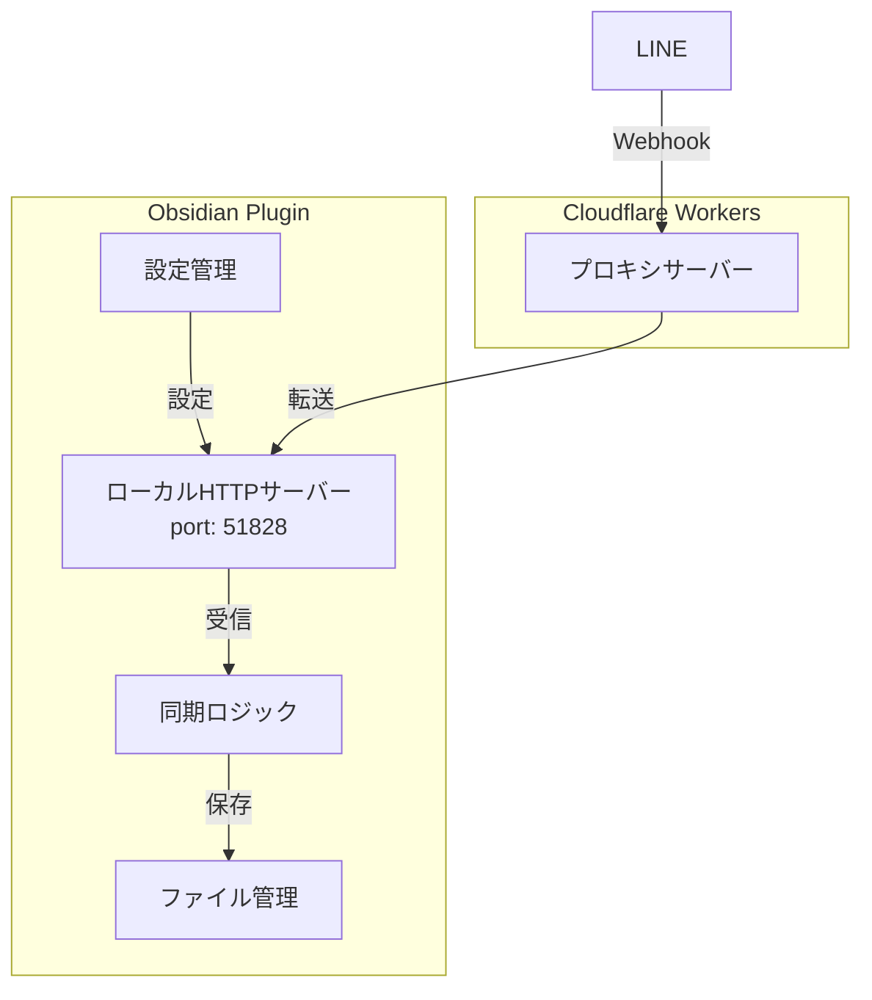

# 新アーキテクチャ設計書

## 概要

このドキュメントでは、LINE to Obsidianプラグインの新しいアーキテクチャについて説明します。新アーキテクチャは外部サーバーへの依存を最小限に抑え、よりシンプルで保守性の高い実装を目指します。

## アーキテクチャ構成



## コンポーネント説明

### 1. ローカルHTTPサーバー

- **役割**: LINEからのWebhookメッセージを受信
- **ポート**: 51828（デフォルト）
- **セキュリティ**:
  - localhost (127.0.0.1) のみアクセス可能
  - トークンベース認証
  - CORS対応

### 2. プロキシサーバー (Cloudflare Workers)

- **役割**: LINEプラットフォームからのWebhookを受信し、ローカルサーバーに転送
- **機能**:
  - LINE署名検証
  - リクエスト転送
  - エラーハンドリング
- **コスト**: Cloudflare Workersの無料枠で十分対応可能

### 3. 設定管理

```typescript
interface LineToObsidianSettings {
    localPort: number;           // ローカルサーバーのポート
    serverToken: string;         // Webhookの認証トークン
    syncFolderPath: string;     // 同期先フォルダ
    lastSync: number | null;    // 最終同期時刻
    syncedNoteIds: string[];    // 同期済みノートID
}
```

### 4. ファイル管理

- メモの保存形式:
```markdown
---
created: 2024-01-01T12:34:56.789Z
source: LINE
note_id: unique-message-id
---

メモの内容
```

## セキュリティ設計

### 1. 認証フロー

1. プラグイン初回起動時にセキュアなトークンを自動生成
2. 生成されたトークンをプラグイン設定画面に表示
3. このトークンをCloudflare Workersの環境変数として設定
4. プロキシサーバーからローカルサーバーへのリクエスト時にトークンを検証

### 2. データ保護

- メッセージはローカルのObsidian Vaultにのみ保存
- プロキシサーバーでのデータ永続化なし
- ローカルサーバーは127.0.0.1のみアクセス可能

### 3. エラーハンドリング

- ネットワークエラー時の適切なフォールバック
- 無効なリクエストの検出と拒否
- 詳細なエラーログ（デバッグモード時のみ）

## 利点

1. **シンプル化**
   - 外部サーバー（Firebase）への依存がなくなる
   - 設定項目の削減
   - メンテナンスの容易化

2. **プライバシー向上**
   - メッセージのローカル保存のみ
   - 中間サーバーでのデータ永続化なし
   - エンドツーエンドの透明性

3. **コスト削減**
   - Firebase有料プラン不要
   - Cloudflare Workers無料枠で運用可能

4. **パフォーマンス向上**
   - 直接的なメッセージ配信
   - 中間ストレージの排除
   - レイテンシの削減

## 実装計画

### フェーズ1: 基本実装

1. ローカルサーバーの実装
2. 設定画面の更新
3. ファイル保存ロジックの実装
4. 基本的なエラーハンドリング

### フェーズ2: プロキシサーバー

1. Cloudflare Workersプロジェクトの作成
2. LINE署名検証の実装
3. プロキシロジックの実装
4. エラーハンドリングの強化

### フェーズ3: テストと最適化

1. ローカル環境でのテスト
2. エッジケースの検証
3. エラーハンドリングの改善
4. ドキュメントの更新

## 注意点

1. **ポート選定**
   - デフォルトポート51828は変更可能
   - 他のアプリケーションとの競合に注意

2. **トークン管理**
   - トークンの安全な保管
   - 定期的な更新メカニズムの検討

3. **エラー対策**
   - ネットワーク切断時の動作
   - プロキシサーバー障害時の対応
   - データ整合性の確保