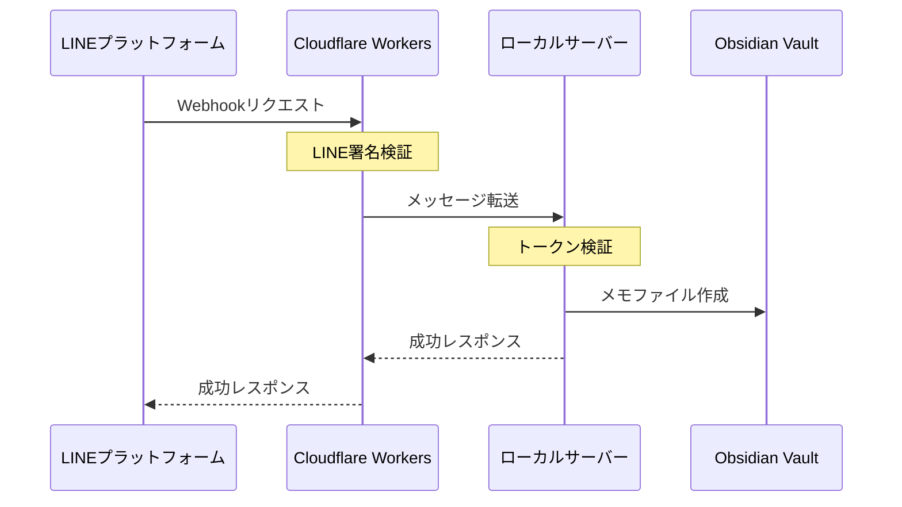

# API仕様

このドキュメントでは、新アーキテクチャにおけるAPIエンドポイントと通信仕様について説明します。

## 1. ローカルサーバーAPI

### エンドポイント
- **URL**: `http://127.0.0.1:{port}/webhook`
- **メソッド**: POST
- **ポート**: デフォルト 51828（設定で変更可能）

### リクエストヘッダー
```
Content-Type: application/json
X-Line-Token: {認証トークン}
```

### リクエストボディ
```json
{
  "type": "message",
  "message": {
    "type": "text",
    "id": "message-id",
    "text": "メモの内容"
  },
  "timestamp": 1462629479859
}
```

### レスポンス
**成功時 (200 OK)**:
```json
{
  "success": true
}
```

**エラー時**:
- 401 Unauthorized: 認証トークンが無効
- 405 Method Not Allowed: POSTメソッド以外のリクエスト
- 500 Internal Server Error: サーバー内部エラー

## 2. プロキシサーバーAPI (Cloudflare Workers)

### エンドポイント
- **URL**: `https://{worker-subdomain}.workers.dev/webhook`
- **メソッド**: POST

### リクエストヘッダー
```
Content-Type: application/json
X-Line-Signature: {LINEプラットフォームからの署名}
```

### 処理フロー
1. LINE署名の検証
2. ローカルサーバーへの転送
3. レスポンスの返却

### エラーハンドリング
- LINE署名検証失敗: 401 Unauthorized
- ローカルサーバー接続エラー: 502 Bad Gateway
- その他のエラー: 500 Internal Server Error

## セキュリティ仕様

### 1. 認証トークン
- 初回起動時に自動生成
- 32バイトの暗号学的乱数を使用
- Base64エンコードされた文字列として保存

### 2. LINE署名検証
```javascript
// Cloudflare Workers側での署名検証
async function verifyLineSignature(request, signature) {
    const body = await request.clone().text();
    const crypto = require('crypto');
    const hmac = crypto.createHmac('sha256', LINE_CHANNEL_SECRET);
    const expectedSignature = hmac.update(body).digest('base64');
    return signature === expectedSignature;
}
```

### 3. CORS設定
ローカルサーバーでの設定:
```typescript
res.setHeader('Access-Control-Allow-Origin', '*');
res.setHeader('Access-Control-Allow-Methods', 'POST');
res.setHeader('Access-Control-Allow-Headers', 'Content-Type, X-Line-Token');
```

## データフロー



## エラー応答フォーマット

エラー発生時は以下の形式でレスポンスを返します：

```json
{
  "success": false,
  "error": {
    "code": "ERROR_CODE",
    "message": "エラーの詳細メッセージ"
  }
}
```

### エラーコード一覧
- `AUTH_ERROR`: 認証エラー
- `INVALID_REQUEST`: 不正なリクエスト
- `SERVER_ERROR`: サーバー内部エラー
- `NETWORK_ERROR`: ネットワークエラー
- `STORAGE_ERROR`: ストレージエラー

## 実装の注意点

1. **ローカルサーバー**
   - 127.0.0.1以外からのアクセスは拒否
   - エラー発生時も適切なJSONレスポンスを返す
   - リクエストタイムアウトの設定

2. **プロキシサーバー**
   - リトライロジックの実装
   - エラーログの適切な管理
   - パフォーマンスモニタリング

3. **エラーハンドリング**
   - 詳細なエラーログ
   - ユーザーフレンドリーなエラーメッセージ
   - 適切なステータスコードの使用