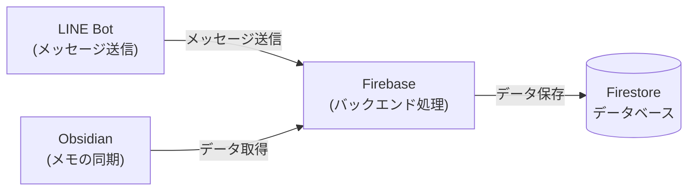
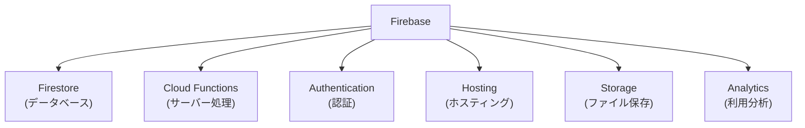
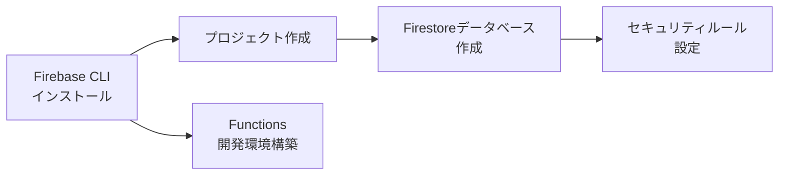
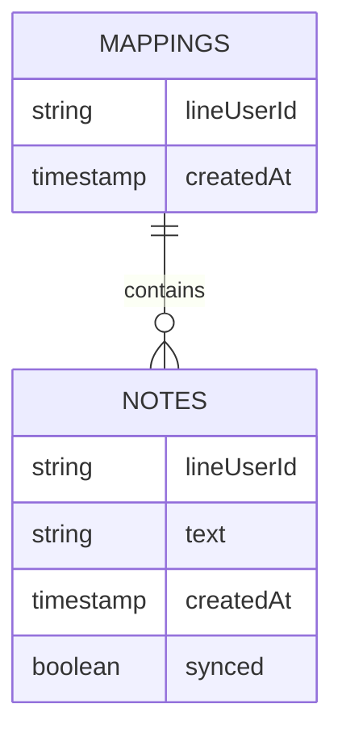
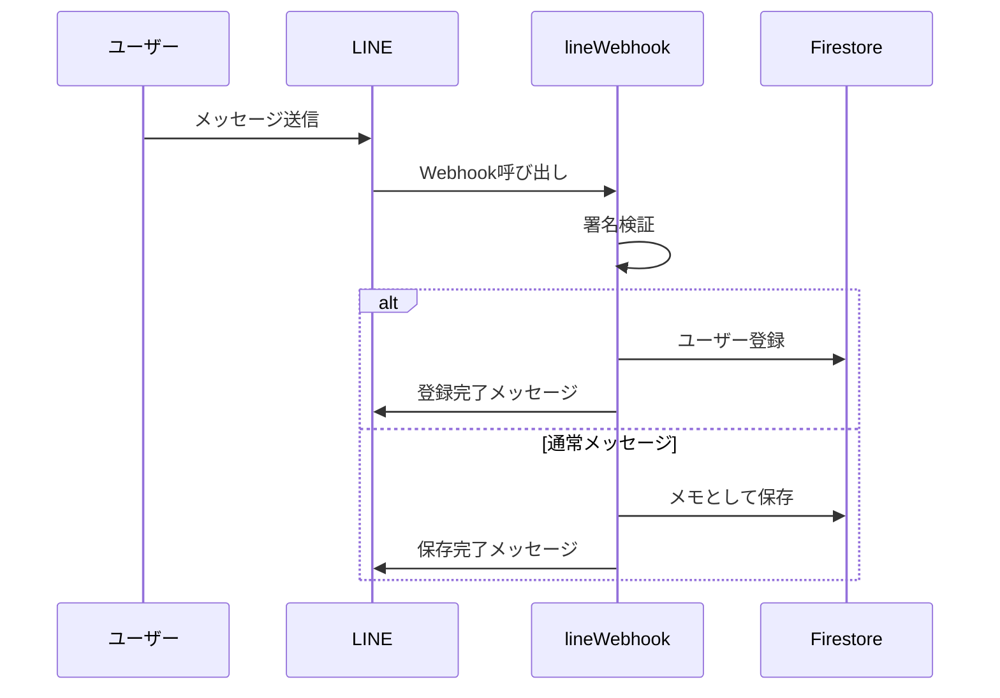
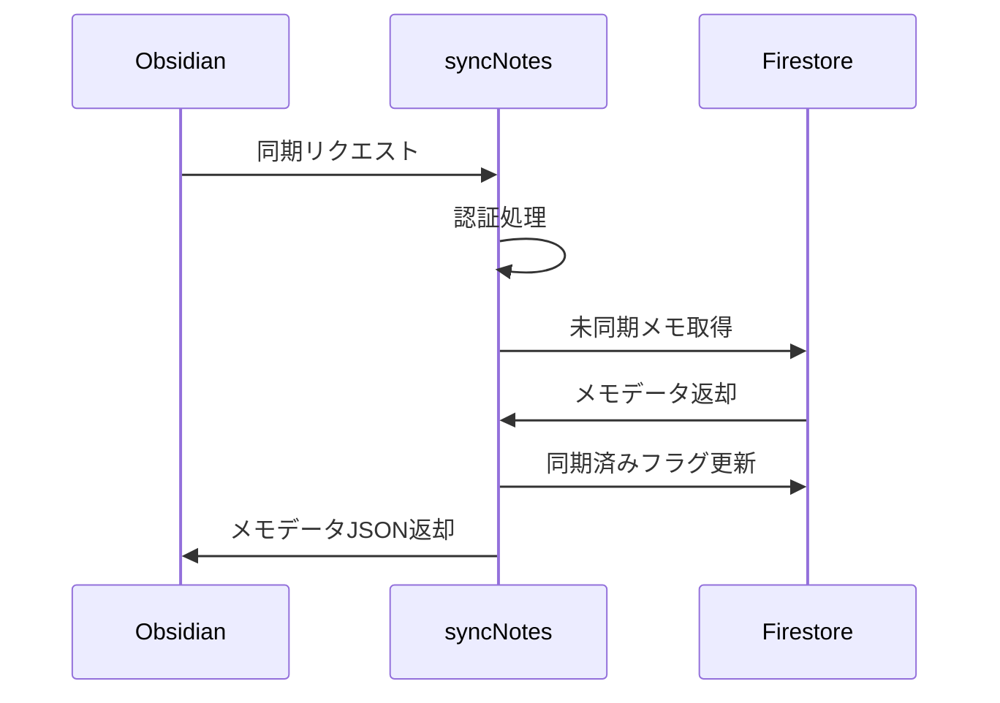
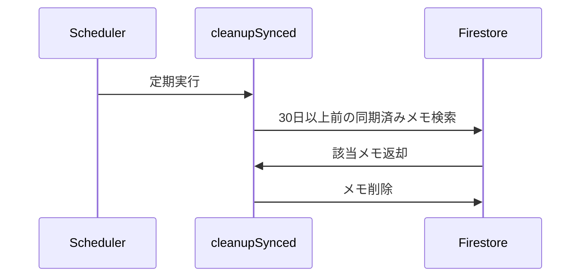
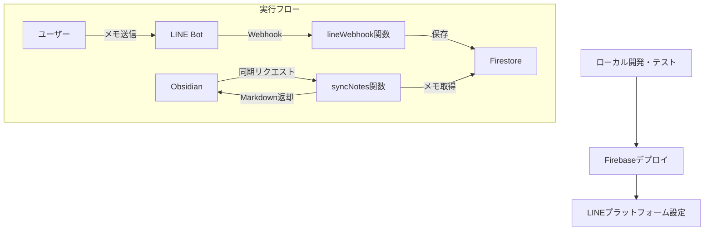
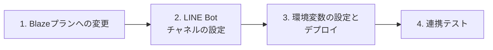

# Firebase バックエンド実装ガイド

## 1. プロジェクト全体の構成

このシステムは3つの主要コンポーネントで構成されています：
1. **LINE Bot**: ユーザーがLINEアプリでメモを送信
2. **Firebase**: メッセージの受信と処理、データの保存
3. **Obsidian Plugin**: 保存されたメモをObsidianに同期

## 2. Firebaseとは？

Firebaseは、Googleが提供するモバイル・ウェブアプリケーション開発プラットフォームです。様々なバックエンド機能を提供し、サーバー側のコードを最小限に抑えながらアプリを開発できます。

このプロジェクトでは主に以下のサービスを使用しています：
- **Firestore**: NoSQLデータベース（メモやユーザー情報の保存）
- **Cloud Functions**: サーバーレス関数（LINEからのWebhookやObsidianとの連携）

## 3. 実装したこと

### 3.1 Firebaseプロジェクトのセットアップ

1. **Firebase CLI** のインストール
   - コマンドラインからFirebaseを操作するためのツール
   - `npm install -g firebase-tools`

2. **Firebaseログイン**
   - `firebase login`

3. **プロジェクト初期化**
   - `firebase init`
   - Firestore、Functions、Emulatorsを選択

### 3.2 Firestoreデータモデル

- **mappings**: LINEユーザーIDとObsidianプラグインの紐付け
- **notes**: LINEから送信されたメモのデータ

### 3.3 Cloud Functions

#### 1. lineWebhook関数

#### 2. syncNotes関数

#### 3. cleanupSynced関数

#### 主要なCloud Functions

1. **lineWebhook**: LINEからのメッセージを受信し処理
   - 署名検証: セキュリティ確保のため
   - #登録コマンド処理: ユーザー登録
   - メモ保存: 通常のメッセージをFirestoreに保存

2. **syncNotes**: Obsidianプラグインからの同期リクエスト処理
   - Bearer認証: セキュリティ
   - マッピングID検証: ユーザー確認
   - 未同期メモ取得: ユーザーのメモを取得
   - 同期済みフラグ更新: 処理済みのメモをマーク

3. **cleanupSynced**: 古いメモのクリーンアップ
   - 30日以上前の同期済みメモを自動削除
   - HTTPトリガーで実装（Blazeプランで定期実行）

## 4. デプロイと実行フロー

### デプロイプロセス

1. **Blazeプランへの変更**
   - 従量課金制プランへの変更（一部機能の制限解除）
   - Firebase Console から変更

2. **環境変数の設定**
   - LINE Bot のシークレットとアクセストークンを設定
   - `firebase functions:config:set line.channel_secret="SECRET" line.channel_access_token="TOKEN"`

3. **Functionsのデプロイ**
   - `firebase deploy --only functions`

4. **動作確認**
   - LINE Bot との連携確認
   - Obsidianプラグインとの連携確認

## 5. Firebase使用時のポイント

### 費用について
- **Sparkプラン（無料）**: 基本的な機能は使えるが制限あり
- **Blazeプラン（従量課金）**: 全機能使用可能、使った分だけ支払い
  - 小規模利用なら月に数ドル程度の場合が多い
  - 使用量に上限を設定可能

### セキュリティ
- **Firestore セキュリティルール**: データアクセス権限の設定
- **認証**: 適切な認証方式の実装
- **環境変数**: 機密情報の安全な管理

### テスト
- **エミュレータ**: ローカル環境でのテスト実行
- **ログ確認**: Firebase Consoleでのログ確認

## 6. 次のステップ

1. **Blazeプランへの変更**
2. **LINE Bot チャネルの設定**
3. **環境変数の設定とデプロイ**
4. **Obsidianプラグインとの連携テスト**

## 7. 参考リソース

- [Firebase 公式ドキュメント](https://firebase.google.com/docs)
- [Cloud Functions ドキュメント](https://firebase.google.com/docs/functions)
- [Firestore ドキュメント](https://firebase.google.com/docs/firestore)
- [LINE Messaging API](https://developers.line.biz/ja/docs/messaging-api/) 